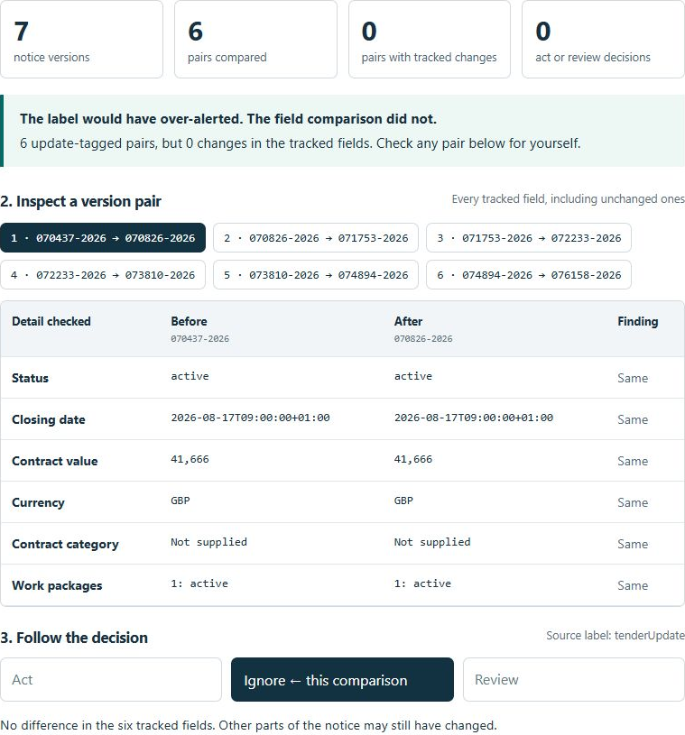
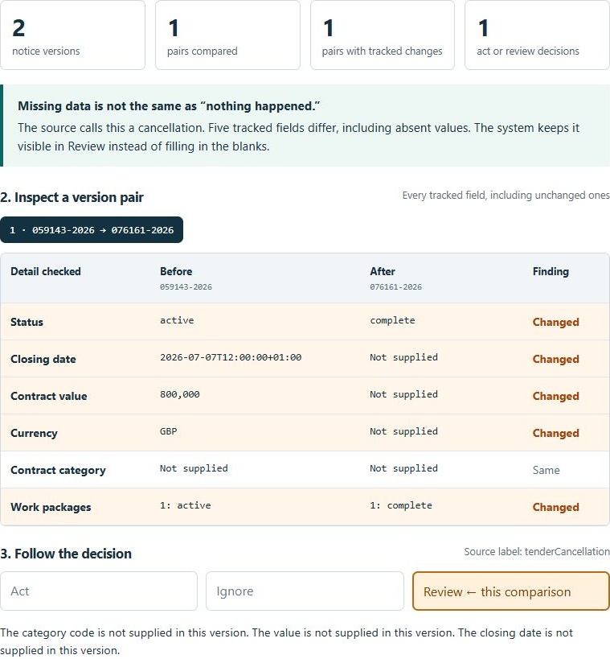
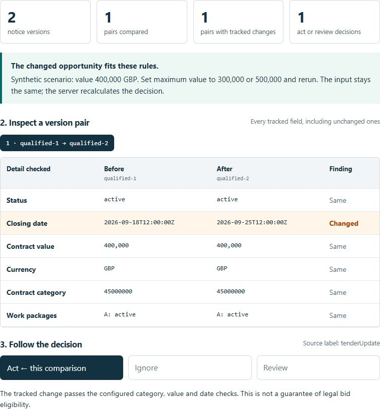
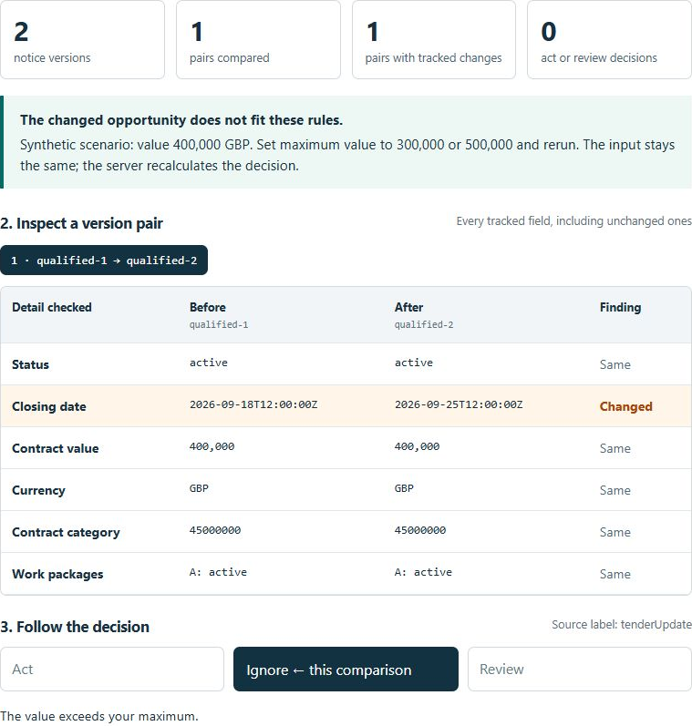

# Recorded browser walkthrough

These are real screenshots of local server executions, captured September 3, 2026 US Eastern (September 4 UTC). They are a recorded step sequence, **not continuous video**. Full-page originals and DOM-measured crop coordinates are retained beside the crops. No result text was composited into the screenshots.

## 1. Do not trust the update label

The first historical record supplies seven versions and six update-tagged comparisons. Comparing the declared fields finds zero differences; all six comparisons are ignored. Other untracked fields may have changed.

## 2. Keep incomplete changes visible

The second historical record carries a cancellation tag and five field differences. Missing qualification details send it to Review rather than a guessed approval.

## 3. Change the rule, not the evidence

This deliberately invented opportunity is worth 400,000 GBP. At a maximum of 5,000,000 GBP, it passes the configured rules.

At a maximum of 300,000 GBP, the same input fails the value rule. Each Run invokes the Python pipeline again.

Launch instructions: [Proof Lab README](../../demo/README.md). The PDF is a guided tour of these results; it does not replace the executable evidence.
